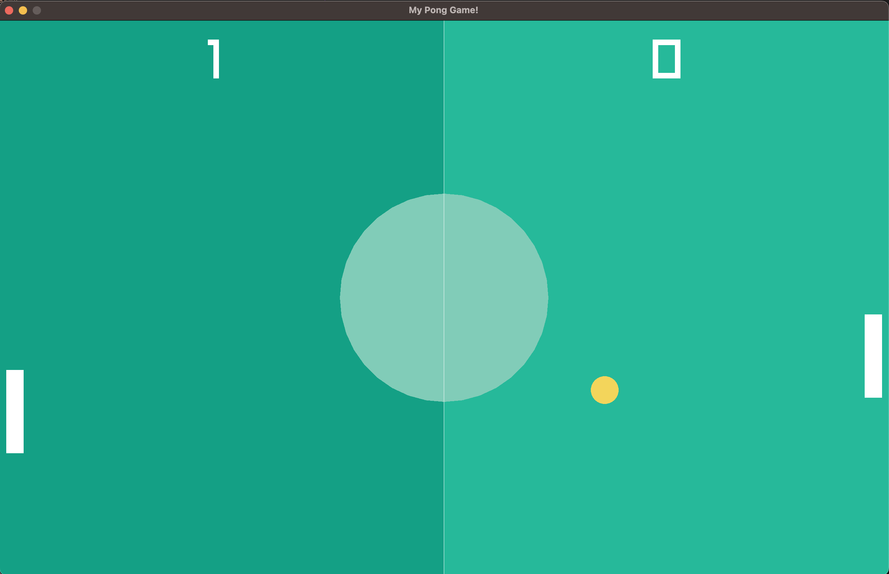

# Overview
### Gamplay Screenshot



### Description
This project was made to learn about making games in C++.  It more or less follows this video: 

https://www.youtube.com/watch?v=VLJlTaFvHo4

This project uses `raylib` ([docs](https://www.raylib.com/index.html))

Downloading raylib instructions for MacOS are here:
- https://github.com/raysan5/raylib/wiki/Working-on-macOS


## Running

I included raylib built for MacOS in this project.  It also needs some other 
dependencies, that can be installed with this command: 
```
xcode-select --install
```

You can run this game on MacOS, but using this command to compile:

```
g++ -std=c++11 -framework CoreVideo -framework IOKit -framework Cocoa -framework GLUT -framework OpenGL -fdiagnostics-color=always -g libraylib.a pong.cpp -o pong
```

and this command to run the game:

```
./pong
```

### Note: you don't need to use g++, you can use whatever compiler you wish
### Note: the above compile commands (and libraylib.a) will only work on MacOS

## Issues

When running this game, it appears to lazy load other libraries the first time
an up or down key is pressed.  I don't know why this is or how to download it 
from the start.  I am just starting to learn about this.  Not sure that my set
up is right or maybe I need to include some compiler optimizer flag, or maybe
I need to build the project differently.  I don't really know.  Anyway, I found
this was a nice start.